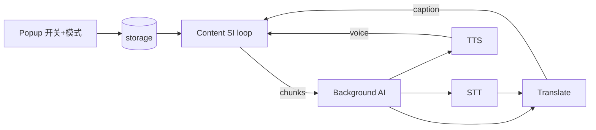

# Blueprint: Lingua Bridge — 同声传译 AI 化扩展

## 1. Requirement Summary

Chrome/Firefox **标准可安装**扩展。**核心亮点**：避免把内容复制到百度/谷歌等翻译工具，实现**页面内自动中英互译**。语音侧提供同声传译基础，用户仅在 **静默字幕** 与 **语音传译** 两模式间选择。打包产物可像普通插件一样安装。

## 2. Architecture Overview

低延迟分片：采音 → STT → 译 → 按 `speechMode` 出字幕或播报。页面文字路径不变。

## 3. Module Breakdown

| Module | Responsibility |
|--------|----------------|
| settings | Key + `speechMode: caption\|voice` + TTS model |
| speech-pipeline | SI chunk loop |
| caption-ui / voice-playback | 双输出 |
| ai-client | translate + transcribe + speech |
| packaging | `wxt zip` → 标准扩展包 + icons |

## 4. Design Assumptions

| # | Assumption | Risk |
|---|------------|------|
| A1 | OpenAI-compatible 提供 chat + audio STT + audio speech | 🔴 |
| A2 | 仅两种语音模式，无其它中间态 | 🟢 |
| A3 | `wxt zip` / firefox zip 可直接加载安装 | 🟡 |

## 5. Open Questions (resolved defaults)

| Q | Resolution |
|---|------------|
| 默认模式 | caption（静默字幕） |
| 语音传译音源 | 页面 video 采集优先 |
| 安装形态 | Chrome/Firefox load unpacked 或 zip 安装，非商店强制 |

## 6. Risk Log

| Risk | Mitigation |
|------|------------|
| TTS 延迟 | 短分片 + 队列播报 |
| DRM 采音失败 | 一次 toast；页面译仍可用 |
| 缺图标/manifest | 打包前强制 icons + 完整 manifest |
